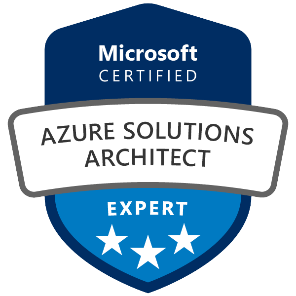
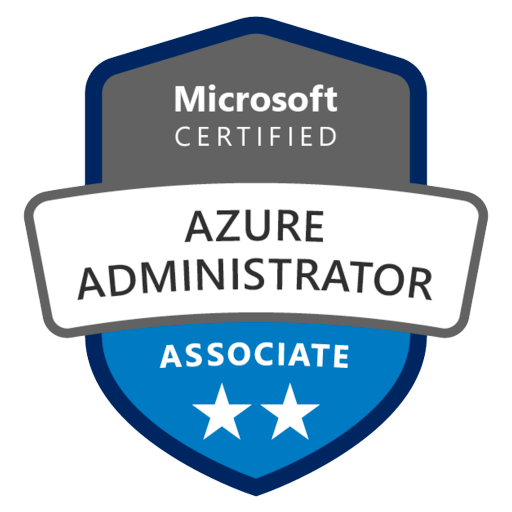
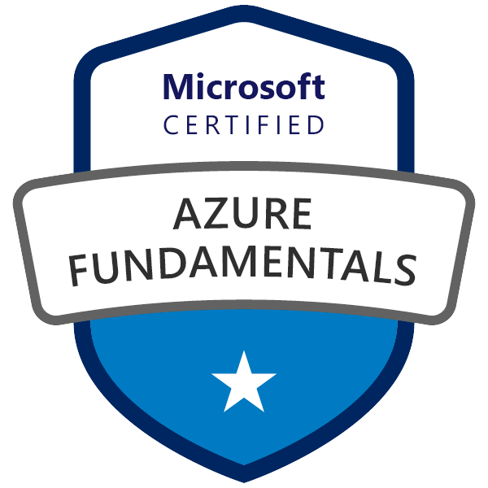

<!-- GitHub Profile README — Dan Payne -->

<p align="center">
  
</p>

<p align="center">
  <a href="https://danpayne.co"></a>&nbsp;
  <a href="https://linkedin.com/in/danpayne5532"></a>
</p>

---

## About

I'm a **Cloud Engineer** and **Azure Solutions Architect Expert** based in Colorado. I took over a manual Azure environment with no automation and turned it into a repeatable, observable, code-driven platform — writing the IaC, the CI/CD pipelines, the identity automation, and the internal tooling from scratch.

Most of my work lives at the intersection of **infrastructure, identity, and developer tooling**: automating employee lifecycle events through Azure Functions and Microsoft Graph, enforcing governance with Entra ID and Conditional Access, and building internal apps that replace expensive SaaS seats or manual processes.

I write a lot of **Node.js and PowerShell** in production, build frontends in **React**, and tinker with **SwiftUI** on the side.

---

## Certifications

<p>
  &nbsp;&nbsp;
  &nbsp;&nbsp;
  
</p>

**Azure Solutions Architect Expert (AZ-305)** · **Azure Administrator Associate (AZ-104)** · **Azure Fundamentals (AZ-900)**

---

## What I Build

**Identity & Lifecycle Automation** — Azure Functions + Graph API pipelines that provision and deprovision Entra ID accounts in under 60 seconds, sync HR data from Paylocity in real time, and close security gaps around terminations.

**Infrastructure as Code** — Terraform, Bicep, and ARM templates replacing ad-hoc portal changes with repeatable, auditable deployments. CI/CD pipelines in Azure DevOps and GitHub Actions for automated testing and release.

**Internal Tooling** — Full-stack apps (React, Express, Azure SQL) that solve real business problems: a Salesforce contact lookup that eliminated per-seat licensing costs, an offshore employee database with Entra ID SSO, and an SFTP monitoring system that replaced manual directory checks.

**On-Prem AI** — A proof-of-concept local LLM pipeline using Ollama with RAG for HIPAA-compatible document processing with zero cloud data exposure.

---

## Tech Stack

```
Cloud & Infra      Azure (VMs, Functions, App Services, Storage, Networking, Monitor)
                   Entra ID · Docker · Windows & Linux Server

IaC & CI/CD        Terraform · Bicep · ARM · Azure DevOps Pipelines · GitHub Actions

Identity           Entra ID · Conditional Access · Intune · Okta SSO · RBAC · Zero Trust

Automation         Azure Functions · PowerShell · Azure CLI · Bash

Dev                Node.js · Express.js · React · Python · Swift
                   Azure SQL · Cosmos DB · REST APIs · Microsoft Graph API

Integrations       Paylocity API · Salesforce API · SFTP/SSH2 · Azure Blob Storage
```

---

## Principles

I care about **eliminating manual toil**, not just managing it. If something is done more than twice, it should be automated, logged, and alertable. I default to infrastructure as code, blameless postmortems, and building things that let the team move faster without sacrificing security or observability.

---
